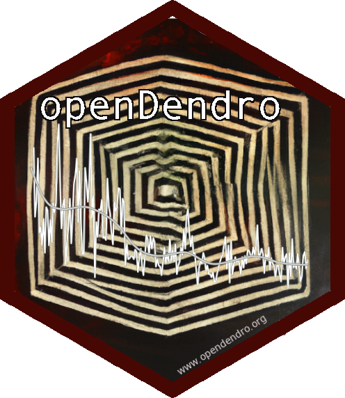

[](https://www.repostatus.org/#wip) [](https://opensource.org/licenses/GPL-3.0) 
<a href="https://doi.org/10.5281/zenodo.6110787"></a>


[](https://nsf.gov/awardsearch/showAward?AWD_ID=2054514)
[](https://nsf.gov/awardsearch/showAward?AWD_ID=2054515)
[](https://nsf.gov/awardsearch/showAward?AWD_ID=2054516)

{width=250}

Code, example data, and manuscript supplemental materials which accompany **openDendro**

Lead Author: [Andy Bunn](https://github.com/AndyBunn/) [](http://orcid.org/0000-0001-9027-2162)

Co-Authors: [Ed Cook](https://scholar.google.com/citations?user=F7jhxf4AAAAJ&hl=en&oi=sra), [Kevin Anchukaitis](http://www.u.arizona.edu/~kanchukaitis/) [](http://orcid.org/0000-0002-8509-8080),  [Tyson Lee Swetnam](https://tyson-swetnam.github.io/) [](http://orcid.org/0000-0002-6639-7181)

## Welcome
Welcome to the home of openDendro -- an open-source framework of the base analytic software tools used in dendrochronology in both the R and Python programming languages. Our goal is to create and curate a unified set of critical tools in open-source environments that will provide the necessary baseline for researchers using tree-ring data to adopt open-science practices and increase both rigor and transparency in dendrochronology.

### History and Motivation
For decades, much of the software used in dendrochronology has been in legacy programming languages which have been maintained by a small number of volunteers. These codebases are at risk of becoming inoperable or incompatible as advances in computing architecture accelerate. This is colloquially known as the "Some random guy in Nebaraska" problem in homage to a cartoon from xckd.


Our motivation with this project is to develop and foster a community of developers to maintain and build open-source software that will be usable by paleoclimatologists using tree-ring data. Modernizing and enhancing this software will also extend both their reach and utility beyond the dendrochronology community and allow integration into related initiatives in the atmospheric and earth sciences. We hope that making these tools open source will also facilitate further collaborative development, broaden the responsibility for collective maintenance and enhancement of this software, and ensure the persistence of these unique tools. 

## Getting Started

Those working or interested in `R` can begin [here](r.md)

Users of Python can being [here](py.md)

## FAIR

The repository is organized (in the attempt) to enable reproducible research as part of the [FAIR data principles](https://www.go-fair.org/fair-principles/).

You can (re)run these analyses using your own computer, on commercial cloud, or a data science workbench [CyVerse](https://cyverse.org) Discovery Environment.

Clone the repo to your local or VM:

```
git clone https://github.com/opendendro/opendendro
```

```
gh repo clone opendendro/opendendro
```
